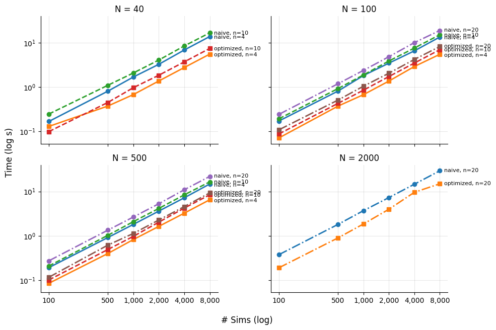

# Baseline Performance

## Runtime Profiling

Surprisingly, one of the largest time offenders is actually `numpy's` printing, and a quick chat with ChatGPT suggests this is also the case for the top two calls. After that, `fit_parametricEB` and matrix inversion methods, the data generating process (generate design matrix), and matrix inversion are the worst offenders.

| ncalls                | tottime | percall | cumtime | percall | function |
|----------------------|---------|---------|---------|---------|----------|
| 5402520              | 10.376  | 0.000   | 32.973  | 0.000   | `<frozen importlib._bootstrap_external>:1624(find_spec)` |
| 27013538             | 7.878   | 0.000   | 13.275  | 0.000   | `<frozen importlib._bootstrap_external>:131(_path_join)` |
| 13272015/72003       | 7.734   | 0.000   | 25.236  | 0.000   | `numpy/_core/arrayprint.py:851(recurser)` |
| 72006                | 7.687   | 0.000   | 19.917  | 0.000   | `methods.py:60(fit_parametricEB)` |
| 5406976              | 6.294   | 0.000   | 6.294   | 0.000   | `{built-in method posix.stat}` |
| 72732                | 6.190   | 0.000   | 12.032  | 0.000   | `dgps.py:195(generate_design_matrix)` |
| 137775872/130645605  | 6.023   | 0.000   | 6.803   | 0.000   | `{built-in method builtins.len}` |
| 1730861              | 5.498   | 0.000   | 10.805  | 0.000   | `numpy/linalg/_linalg.py:557(inv)` |
| 12384012             | 5.313   | 0.000   | 7.278   | 0.000   | `numpy/_core/arrayprint.py:1092(__call__)` |
| 1580139              | 4.887   | 0.000   | 5.019   | 0.000   | `statsmodels/discrete/discrete_model.py:2363(cdf)` |
| 59020746             | 4.703   | 0.000   | 6.398   | 0.000   | `{built-in method builtins.isinstance}` |
| 145464               | 4.524   | 0.000   | 5.136   | 0.000   | `numpy/linalg/_linalg.py:1689(svd)` |
| 4109661              | 4.310   | 0.000   | 4.310   | 0.000   | `{method 'reduce' of 'numpy.ufunc' objects}` |
| 216010               | 4.248   | 0.000   | 12.661  | 0.000   | `methods.py:177(fit_semiBayes)` |
| 1580139              | 3.731   | 0.000   | 8.400   | 0.000   | `statsmodels/discrete/discrete_model.py:488(predict)` |
| 502469               | 3.670   | 0.000   | 6.448   | 0.000   | `statsmodels/discrete/discrete_model.py:2557(hessian)` |
| 502469               | 3.594   | 0.000   | 7.877   | 0.000   | `numpy/_core/numeric.py:2373(isclose)` |
| 24768024             | 3.460   | 0.000   | 3.460   | 0.000   | `{built-in method numpy._core._multiarray_umath.dragon4_positional}` |
| 12384012             | 3.311   | 0.000   | 4.963   | 0.000   | `numpy/_core/arrayprint.py:801(_extendLine)` |
| 12384012             | 3.215   | 0.000   | 9.420   | 0.000   | `numpy/_core/arrayprint.py:815(_extendLine_pretty)` |
| 55402005             | 3.108   | 0.000   | 3.108   | 0.000   | `{method 'rstrip' of 'str' objects}` |
| 1081864              | 2.904   | 0.000   | 42.767  | 0.000   | `<frozen importlib._bootstrap>:1240(_find_spec)` |
| 72732                | 2.903   | 0.000   | 33.759  | 0.000   | `statsmodels/base/optimizer.py:385(_fit_newton)` |
| 72732                | 2.869   | 0.000   | 2.934   | 0.000   | `scipy/linalg/_decomp_qr.py:13(safecall)` |
| 27108779             | 2.547   | 0.000   | 2.879   | 0.000   | `{method 'join' of 'str' objects}` |
| 1081858              | 2.540   | 0.000   | 36.623  | 0.000   | `<frozen importlib._bootstrap_external>:1522(_get_spec)` |
| 72003                | 2.143   | 0.000   | 11.975  | 0.000   | `numpy/_core/arrayprint.py:1001(fillFormat)` |
| 429737               | 2.066   | 0.000   | 4.353   | 0.000   | `numpy/linalg/_linalg.py:382(solve)` |
| 12456015             | 1.921   | 0.000   | 5.658   | 0.000   | `numpy/_core/arrayprint.py:1061(<genexpr>)` |
| 2729168              | 1.741   | 0.000   | 5.100   | 0.000   | `numpy/_core/fromnumeric.py:89(_wrapreduction_any_all)` |
| 1730132              | 1.676   | 0.000   | 2.331   | 0.000   | `numpy/lib/_twodim_base_impl.py:176(eye)` |
| 1081901/1080065      | 1.535   | 0.000   | 54.975  | 0.000   | `<frozen importlib._bootstrap>:1349(_find_and_load)` |
| 2448216              | 1.478   | 0.000   | 3.831   | 0.000   | `xarray/core/variable.py:245(as_compatible_data)` |
| 27014561             | 1.437   | 0.000   | 1.437   | 0.000   | `<frozen importlib._bootstrap>:491(_verbose_message)` |
| 12456015             | 1.419   | 0.000   | 2.913   | 0.000   | `numpy/_core/arrayprint.py:1056(<genexpr>)` |
| 72732                | 1.411   | 0.000   | 204.924 | 0.003   | `simulation.py:92(_run_simulation)` |
| 1083097              | 1.407   | 0.000   | 4.628   | 0.000   | `<frozen importlib._bootstrap>:304(acquire)` |
| 1433172              | 1.381   | 0.000   | 3.837   | 0.000   | `{built-in method builtins.max}` |
| 2306063              | 1.350   | 0.000   | 2.734   | 0.000   | `numpy/linalg/_linalg.py:207(_commonType)` |
| 2232207              | 1.339   | 0.000   | 3.242   | 0.000   | `xarray/namedarray/core.py:502(_parse_dimensions)` |
| 2305018/1512528      | 1.328   | 0.000   | 2.554   | 0.000   | `statsmodels/base/wrapper.py:21(__getattribute__)` |
| 13681919             | 1.283   | 0.000   | 1.595   | 0.000   | `{built-in method builtins.getattr}` |
| 864081               | 1.276   | 0.000   | 56.835  | 0.000   | `xarray/core/indexing.py:1875(__init__)` |
| 1335137              | 1.213   | 0.000   | 1.213   | 0.000   | `{method 'trace' of 'numpy.ndarray' objects}` |
| 502469               | 1.169   | 0.000   | 4.028   | 0.000   | `statsmodels/discrete/discrete_model.py:2476(score)` |
| 2232207              | 1.169   | 0.000   | 7.901   | 0.000   | `xarray/core/variable.py:371(__init__)` |
| 1080054              | 1.161   | 0.000   | 56.805  | 0.000   | `xarray/core/utils.py:1296(attempt_import)` |
| 14441683             | 1.146   | 0.000   | 1.146   | 0.000   | `{method 'get' of 'dict' objects}` |
| 1080090              | 1.135   | 0.000   | 66.447  | 0.000   | `xarray/core/indexes.py:499(safe_cast_to_index)` |
| 1080090              | 1.121   | 0.000   | 58.937  | 0.000   | `xarray/core/indexes.py:487(_maybe_cast_to_cftimeindex)` |

## Computational complexity

The following plot shows both the optimized code and the naive code that I first implemented. We can see there is certainly a speed up, though the exact amount is unclear due to the log-log scale. This will be explored in the optimization comparison.

## Computational complexity

The array printing, aside, the large culprit is the `fit_parametricEB` function, which is an iterative EM algorithm that in the base configuration, requires several matrix inversions per iteration. I removed all except one, instead using an eigendecomposition for the iterative updating part. This was another ChatGPT suggestion for making the code faster, which after testing, seemed to work. However, I dislike that the AI effectively wrote this optimization for me.

